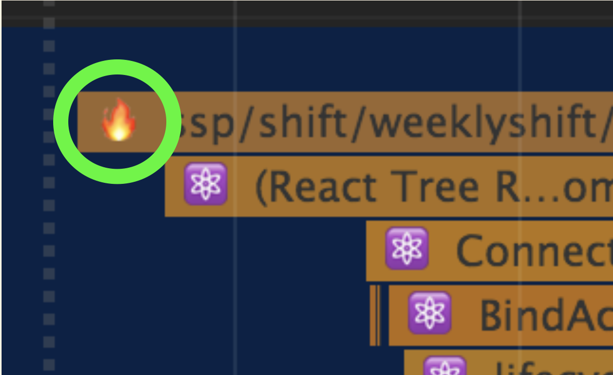
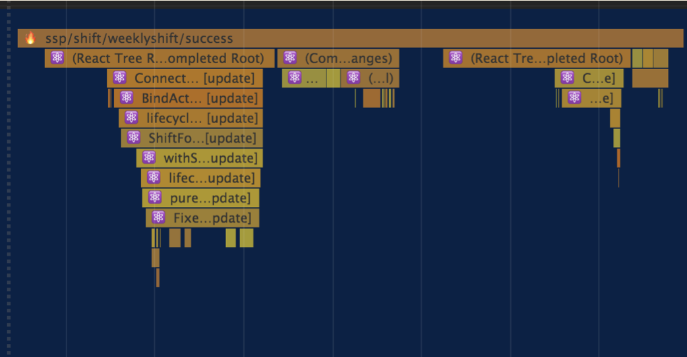

# redux-action-timing-middleware





> Add marker of redux-action to User Timing in profile.

Installation
---

```bash
$ npm i --save-dev redux-action-timing-middleware
# or
$ yarn add --dev redux-action-timing-middleware
```

Usage
---

```javascript
import { applyMiddleware, compose, createStore } from "redux";
import actionTiming from "redux-action-timing-middleware"

const createReduxStore = (reducer, initialState) => {
  const middlewares = [
    // Please put top in middleware list.
    actionTiming(),

    middlewareA,
    middlewareB
  ]

  return createStore(
    reducer,
    initialState,
    compose(applyMiddleware(...middlewares))
  )
}

export default createReduxStore
```

Option
---

- actionTiming(enable: boolean = true): void

Please set NODE_ENV to arguments, if you use only development

```
const middlewares = [
  // Please put top in middleware list.
  actionTiming(process.env.NODE_ENV === 'development'),

  middlewareA,
  middlewareB
]
```


LICENSE
---

Licensed under the MIT License.
